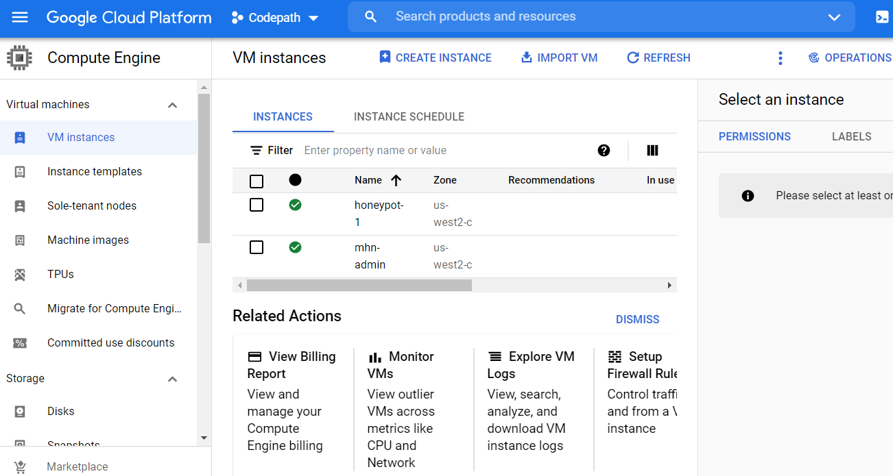
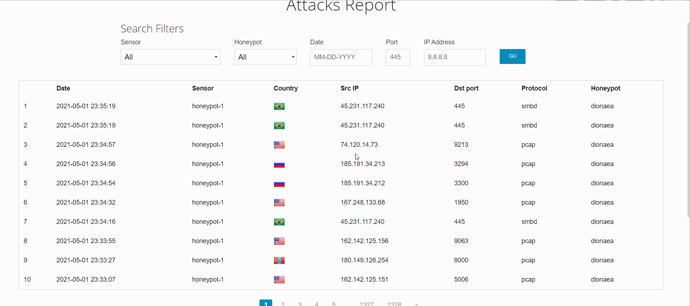
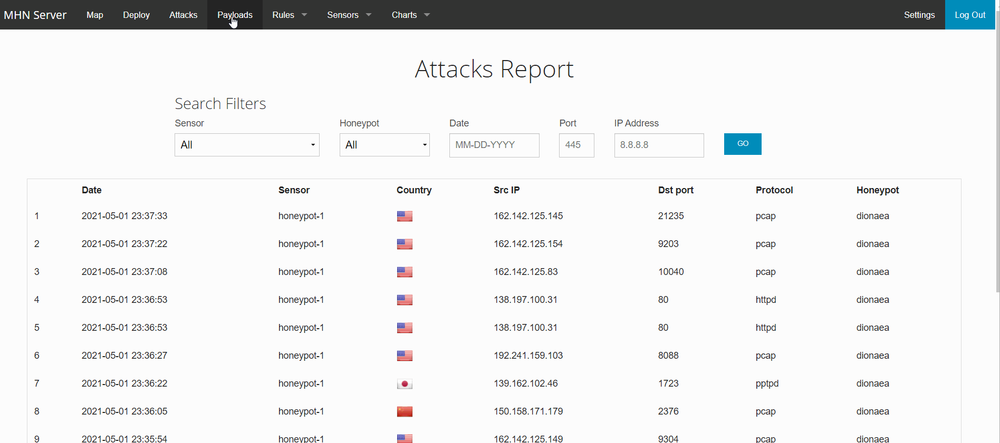
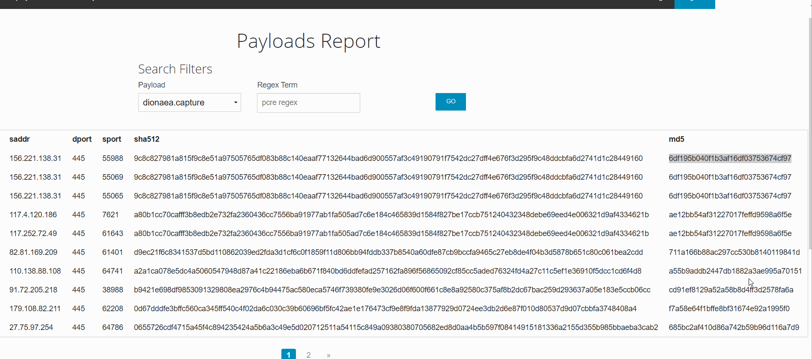

# Honeypot Assignment

**Time spent:** **10** hours spent in total

**Objective:** Create a honeynet using MHN-Admin. Present your findings as if you were requested to give a brief report of the current state of Internet security. Assume that your audience is a current employer who is questioning why the company should allocate anymore resources to the IT security team.

### MHN-Admin Deployment (Required)

**Summary:** How did you deploy it? Did you use GCP, AWS, Azure, Vagrant, VirtualBox, etc.?
I use Google Cloud Platform to deploy it.

 

### Dionaea Honeypot Deployment (Required)

**Summary:** Briefly in your own words, what does dionaea do?
Dionaea return the ports that has been scanned. For instance in my case, I nmap scan my Dionaea honeypot to test it and my mhn-admin site shows the ports that nmap have scanned as attacks.  

### Database Backup (Required) 

**Summary:**
 What is the RDBMS that MHN-Admin uses? MHN-Admin uses MongoDB.

 What information does the exported JSON file record? It records all the information(destination ports,source ip address, timestamps, countires and protocol) that the honeypot receives. 
 

*Be sure to upload session.json directly to this GitHub repo/branch in order to get full credit.*

### Deploying Additional Honeypot(s) (Optional)

#### X Honeypot

**Summary:** What does this honeypot simulate and do for a security researcher?

### Malware Capture and Identification (Optional)

#### Trojan Malware

**Summary:** How did you find it? I go to payloads and select dionaea.capture in the mhn-admin site. Which honeypot captured it? 
I use Honeypot Dionaea to capture it.

What does each malware do?
The Trojan downloader malware is a trojan horse(looks like a legitable software but it contains malicious files and programs) that will install malicious programs into the computer without user's consent. 

MD5 Hash: 6df195b040f1b3af16df03753674cf97

SHA1 Hash: c14d273995ce12db691687c0cfde7e31056ef380

## Notes

I had to reinstall the honeypot VM because it didn't recieve much attacks and this took the majority of my time to complete this assignment 
